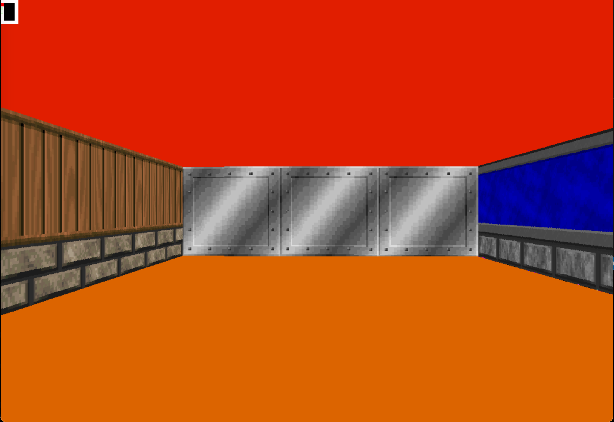

# cub3D

Этот проект вдохновлен всемирно известной 3D-игрой Wolfenstein, которая
была первой FPS в истории. Вашей целью будет создание лабиринта, используя
raycasting (как в [Wolfenstein 3D](https://fr.wikipedia.org/wiki/Wolfenstein_3D)).

# SUMMARY

- [x] Mandatory part
* WASD to move, QE or Left/Right directional keys to rotate camera

* ESC to quit

* Textures for each sides (North, South, West, East) and Sky/Floor

* Crosshair

* Minimap

* Collectable items

# RUN

```bash
make && ./cub3D maps/<map>
```

# GAME

- [x] Key comands to move around the maze

* W A S D to move the point of view
* Mouse or Left/Right (←/→) directional keys to rotate the camera
* ESC to quit

# POV



#	Resources
*	[MiniLibX](https://harm-smits.github.io/42docs/libs/minilibx/introduction.html)
*	[Raycaster](https://lodev.org/cgtutor/raycasting.html)