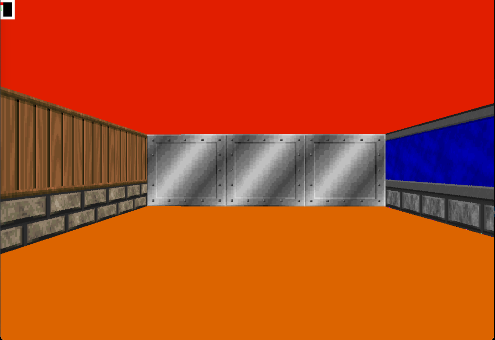
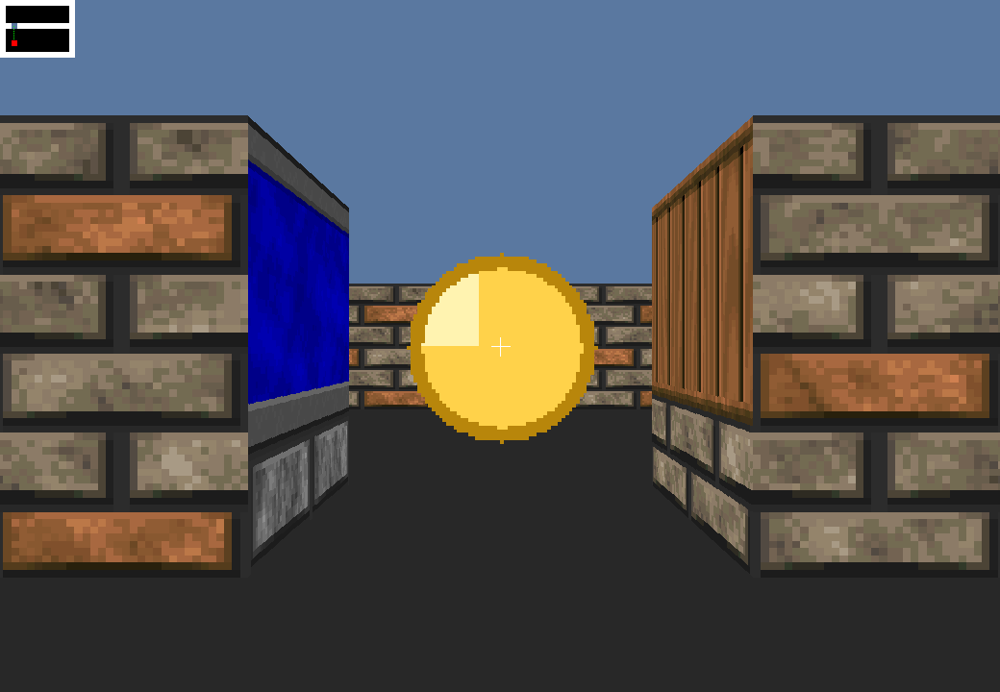

# cub3D

Псевдо-3D движок от первого лица в стиле *Wolfenstein 3D*, написанный на C с
использованием MiniLibX. Проект из учебной программы **School 42**: по карте-лабиринту
и текстурам движок строит трёхмерную сцену методом **raycasting** (алгоритм DDA).



## Возможности

### Обязательная часть

- Псевдо-3D рендеринг методом raycasting с текстурированием всех четырёх сторон стен
- Отдельные цвета пола и потолка
- Перемещение и поворот камеры
- Парсер карт `.cub` с валидацией: замкнутость лабиринта, наличие текстур и цветов,
  корректная стартовая позиция игрока

### Бонусная часть

- **Двери**, которые открываются и закрываются: анимированный сдвиг створки с
  просмотром помещения за дверью
- **Анимированные спрайты-коллекции** (монеты): отрисовка билбордов с учётом
  глубины (Z-буфер), прозрачностью и сменой кадров; предмет исчезает при подборе
- **Коллизии** игрока со стенами (и с закрытыми дверями)
- **Мини-карта** с положением и направлением игрока
- **Вращение камеры мышью** (ЛКМ включает и выключает захват курсора)
- **Прицел** по центру экрана



## Управление

| Действие                     | Клавиша                  |
| ---------------------------- | ------------------------ |
| Движение                     | `W` / `A` / `S` / `D`    |
| Поворот камеры               | `←` / `→` или мышь       |
| Открыть/закрыть дверь рядом  | `E` или `Space`          |
| Захват/освобождение курсора  | левая кнопка мыши        |
| Выход                        | `ESC`                    |

## Сборка и запуск

Проект рассчитан на **macOS**: MiniLibX использует OpenGL и AppKit. Понадобятся `gcc`,
`make` и Xcode Command Line Tools.

```bash
make
./cub3D maps/map4.cub      # обязательная часть
./cub3D maps/bonus.cub     # бонус: двери и коллекции
```

Готовые к запуску карты лежат в `maps/`: `map4.cub`, `map5.cub`, `map6.cub`, `bonus.cub`.
Остальные файлы в `maps/` — негативные фикстуры для проверки парсера (отсутствие
игрока, незамкнутые стены, неверный формат).

```bash
make clean    # удалить объектные файлы
make fclean   # удалить объектные файлы, бинарник и библиотеки
make re       # полная пересборка
```

## Формат карты `.cub`

```
NO ./txt/NorthMetallic.xpm      # текстура северной стены
SO ./txt/SouthMultibrickL.xpm   # текстура южной стены
WE ./txt/WestWoodbrickL.xpm     # текстура западной стены
EA ./txt/EastBluegreyL.xpm      # текстура восточной стены
F 220,100,0                     # цвет пола (R,G,B)
C 225,30,0                      # цвет потолка (R,G,B)

1111111111
1000000001
10N0000001                      # N/S/E/W — позиция и направление игрока
10D2000001                      # D — дверь, 2 — коллекция
1111111111
```

| Символ   | Значение                                             |
| -------- | ---------------------------------------------------- |
| `1`      | стена                                                |
| `0`      | свободная клетка                                     |
| `N S E W`| старт игрока и направление взгляда                   |
| `D`      | дверь (открывается/закрывается по `E`/`Space`)       |
| `2`      | анимированная коллекция (исчезает при подборе)       |

Двери и коллекции размещаются внутри лабиринта; дверь соединяет две свободные клетки и
не ставится на внешнюю границу. Текстуры двери (`txt/Door.xpm`) и кадров коллекции
(`txt/Coin1.xpm` … `txt/Coin4.xpm`) встроены в проект. Файл карты сохраняется **без
завершающего перевода строки** (иначе парсер считает лишнюю пустую строку ошибкой).

## Структура проекта

```
includes/   заголовки (cub3D.h)
src/        исходники движка: raycasting, draw, doors, sprites, parser, hook, ...
libft/      собственная реализация части стандартной библиотеки C
mlx/        MiniLibX
maps/       карты в формате .cub
txt/        текстуры (стены, дверь, кадры коллекций) в формате XPM
```

## Ресурсы

- [Raycasting (Lode Vandevenne)](https://lodev.org/cgtutor/raycasting.html)
- [Sprite casting (Lode Vandevenne)](https://lodev.org/cgtutor/raycasting3.html)
- [MiniLibX — документация](https://harm-smits.github.io/42docs/libs/minilibx/introduction.html)

## Автор

**achanel** — [github.com/achanel](https://github.com/achanel)
